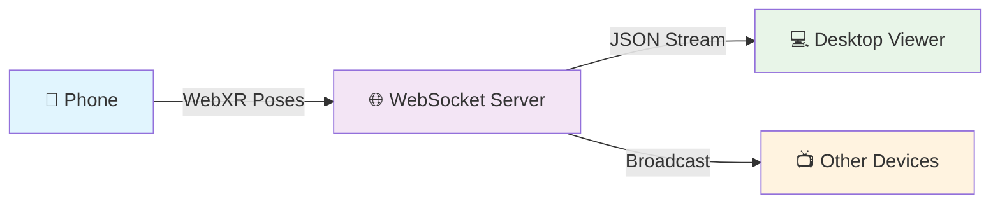

# 📡 WebXR Pose Streaming Server

<div align="center">


**Real-time AR head tracking and 3D visualization across devices**

Stream pose data from your phone's WebXR session to any browser in real-time

[🚀 Quick Start](#-quick-start) • [📖 Documentation](#-how-it-works) • [🛠️ API](#️-tech-stack) • [🤝 Contributing](#-contributing)

</div>

---

## 🎯 Overview

Transform your smartphone into a **wireless AR tracker** and visualize head movements on any device with a browser. This self-contained solution streams real-time position and orientation data using WebXR and WebSocket technology.

### ✨ Key Features

- 🔄 **Real-time streaming** - Sub-100ms latency pose updates
- 📱 **Mobile-first design** - Optimized for touch devices
- 🌐 **Cross-platform** - Works on any WebXR-capable browser
- 🔧 **Zero configuration** - Auto-detects HTTP/HTTPS protocols
- 🎮 **3D visualization** - Interactive Three.js viewer
- ⚡ **Performance optimized** - Minimal UI, maximum efficiency

---

## 🚀 Quick Start

### 1️⃣ Installation

```bash
# Clone the repository
git clone https://github.com/your-username/webxr-pose-streaming.git
cd webxr-pose-streaming

# Install dependencies
pip install aiohttp

# Run the server
python all_in_one.py --host 0.0.0.0 --port 8765
```

### 2️⃣ Expose via HTTPS Tunnel

```bash
# Install Cloudflare tunnel (if not already installed)
# https://developers.cloudflare.com/cloudflare-one/connections/connect-apps/install-and-setup/

# Create secure tunnel
cloudflared tunnel --url http://localhost:8765
```

**Output:** `https://random-subdomain.trycloudflare.com`

### 3️⃣ Connect Your Devices

| Device | URL | Purpose |
|--------|-----|---------|
| 📱 **Phone** | `/pose` | AR tracking sender |
| 💻 **Desktop** | `/viewer` | 3D visualization |
| 🔍 **Any** | `/` | Server status |

---

## 📋 Usage Workflow



### Step-by-step:

1. **🔗 Open pose tracker** - Visit `/pose` on your AR-capable phone
2. **🎯 Start WebXR session** - Tap "Start Tracking" and allow camera access
3. **📊 Open viewer** - Visit `/viewer` on your desktop/laptop
4. **🎮 Move around** - Phone movement controls the 3D camera in real-time

---

## 🛠️ Tech Stack

<table>
<tr>
<td width="50%">

### Backend
- **🐍 Python 3.9+** - Async server runtime
- **⚡ aiohttp** - HTTP server & WebSocket handler  
- **🔄 asyncio** - Concurrent connection management
- **📡 WebSocket** - Real-time bidirectional communication

</td>
<td width="50%">

### Frontend  
- **🥽 WebXR API** - Native browser AR tracking
- **🎨 Three.js** - Hardware-accelerated 3D rendering
- **📱 Mobile-first CSS** - Touch-optimized interfaces
- **⚡ ES6 Modules** - Modern JavaScript architecture

</td>
</tr>
</table>

---

## 📖 How It Works

### Architecture Overview

```
┌─────────────────┐    WebSocket     ┌─────────────────┐
│   📱 AR Phone    │◄─────────────────►│  🖥️  Python      │
│                 │   JSON Poses     │    Server       │
│ • WebXR Session │                  │                 │
│ • Pose Tracking │                  │ • Pose Storage  │
│ • Data Sending  │                  │ • Broadcasting  │
└─────────────────┘                  └─────────────────┘
                                             │
                                      WebSocket Broadcast
                                             │
                                             ▼
                                  ┌─────────────────┐
                                  │ 💻 3D Viewers    │
                                  │                 │
                                  │ • Three.js      │
                                  │ • Real-time     │
                                  │ • Multi-device  │
                                  └─────────────────┘
```

### Data Flow

1. **📊 Pose Capture** - WebXR API provides 6DOF tracking data
2. **📤 JSON Transmission** - Structured pose data sent via WebSocket  
3. **⚡ Server Processing** - Normalizes timestamps, computes velocities
4. **📡 Broadcasting** - Real-time distribution to all connected viewers
5. **🎨 3D Rendering** - Three.js updates virtual camera position

### WebSocket Message Format

```json
{
  "clientId": "abc123",
  "ts": 1640995200.123,
  "position": { "x": 0.5, "y": 1.2, "z": -0.8 },
  "rotation": { "x": 0.0, "y": 0.1, "z": 0.0, "w": 0.99 },
  "velocity": {
    "vx": 0.02, "vy": 0.01, "vz": -0.03,
    "speed_m_s": 0.037, "dt": 0.033
  }
}
```

---

## ⚙️ Configuration

### Server Options

```bash
python all_in_one.py [OPTIONS]

OPTIONS:
  --host HOST          Bind address (default: 0.0.0.0)
  --port PORT          Port number (default: 8765)  
  --certfile CERT      SSL certificate for HTTPS
  --keyfile KEY        SSL private key for HTTPS
```

### Environment Variables

```bash
export HOST=0.0.0.0
export PORT=8765
```

### Performance Tuning

| Setting | Default | Description |
|---------|---------|-------------|
| Max Send Rate | 30 Hz | Throttles pose updates to prevent spam |
| WebSocket Heartbeat | 30s | Keep-alive interval |
| Position Scale | 2.0x | Movement amplification factor |

---

## 🎮 Advanced Usage

### Custom Viewer Modifications

#### Disable Rotation (Translation Only)
```javascript
// In viewer.html, replace camera rotation line with:
// Remove: camera.quaternion.copy(latestPose.rotation);
camera.quaternion.set(0, 0, 0, 1); // Fixed orientation
```

#### Adjust Movement Scaling
```javascript
const SCALE = 5.0; // Amplify movements 5x
camera.position.set(
  latestPose.position.x * SCALE,
  latestPose.position.y * SCALE,
  latestPose.position.z * SCALE
);
```

#### Add Custom 3D Objects
```javascript
// Add to scene in viewer.html
const customMesh = new THREE.Mesh(
  new THREE.SphereGeometry(0.5),
  new THREE.MeshBasicMaterial({ color: 0xff0000 })
);
scene.add(customMesh);
```

---

## 🚨 Troubleshooting

<details>
<summary><strong>❌ WebXR not supported</strong></summary>

**Solution:**
- Use Chrome/Edge on Android (iOS Safari doesn't support AR yet)
- Ensure HTTPS connection (WebXR requires secure context)
- Check device compatibility: [WebXR compatibility](https://immersiveweb.dev/)
</details>

<details>
<summary><strong>🔌 WebSocket connection failed</strong></summary>

**Solution:**
```bash
# Check server is running
curl http://localhost:8765/healthz

# Verify tunnel is active
curl https://your-tunnel.trycloudflare.com/status

# Check firewall/network settings
```
</details>

<details>
<summary><strong>📱 Camera permission denied</strong></summary>

**Solution:**
- Grant camera permissions in browser settings
- Try refreshing the page after granting permissions
- Use incognito/private mode to reset permissions
</details>

<details>
<summary><strong>⚡ Poor performance/lag</strong></summary>

**Solution:**
- Reduce update rate in pose sender
- Close other browser tabs
- Use a closer tunnel endpoint
- Check network latency with `ping`
</details>

---

## 🌟 Use Cases

| Scenario | Description | Benefits |
|----------|-------------|----------|
| **🎓 Education** | Teaching AR/VR concepts | Visual, interactive learning |
| **🔬 Research** | Motion tracking experiments | Real-time data collection |
| **🎮 Prototyping** | AR app development | Rapid iteration, cross-device testing |  
| **👥 Collaboration** | Remote AR sessions | Share perspective in real-time |
| **🎪 Demos** | Trade shows, presentations | Impressive, accessible technology showcase |

---

## 📊 Performance Metrics

| Metric | Target | Typical |
|--------|---------|---------|
| **Latency** | <100ms | 50-80ms |
| **Update Rate** | 30 Hz | 25-30 Hz |
| **Memory Usage** | <50MB | 20-30MB |
| **CPU Usage** | <5% | 2-3% |
| **Network** | <1 Mbps | 100-500 Kbps |

---

## 🔐 Security Considerations

- **🔒 HTTPS Required** - WebXR mandates secure contexts
- **🌐 CORS Enabled** - Cross-origin requests supported  
- **🔄 Input Validation** - All WebSocket messages sanitized
- **⏰ Rate Limiting** - Prevents client spam/DoS
- **🚫 No Authentication** - Consider adding auth for production use

---

## 🤝 Contributing

We welcome contributions! Here's how to get started:

### Development Setup

```bash
# Clone repository
git clone https://github.com/your-username/webxr-pose-streaming.git
cd webxr-pose-streaming

# Create virtual environment  
python -m venv venv
source venv/bin/activate  # Windows: venv\Scripts\activate

# Install development dependencies
pip install -r requirements.txt
pip install -r requirements-dev.txt

# Run tests
python -m pytest tests/

# Start development server
python all_in_one.py --host 0.0.0.0 --port 8765
```

### Contribution Guidelines

- 🐛 **Bug Reports** - Use GitHub issues with detailed reproduction steps
- 💡 **Feature Requests** - Describe use case and expected behavior  
- 🔧 **Pull Requests** - Include tests and update documentation
- 📝 **Code Style** - Follow PEP 8 for Python, ESLint for JavaScript

### Roadmap

- [ ] **🔐 Authentication system** - User login and session management
- [ ] **📊 Analytics dashboard** - Usage metrics and performance monitoring  
- [ ] **🎮 Multiple AR sessions** - Support concurrent tracking sessions
- [ ] **🎨 Visual effects** - Particle systems, post-processing
- [ ] **📁 Pose recording** - Save and replay tracking sessions
- [ ] **🔌 Plugin system** - Extensible architecture for custom features

---

## 📄 License

```
MIT License

Copyright (c) 2024 WebXR Pose Streaming Contributors

Permission is hereby granted, free of charge, to any person obtaining a copy
of this software and associated documentation files (the "Software"), to deal
in the Software without restriction, including without limitation the rights
to use, copy, modify, merge, publish, distribute, sublicense, and/or sell
copies of the Software, and to permit persons to whom the Software is
furnished to do so, subject to the following conditions:

The above copyright notice and this permission notice shall be included in all
copies or substantial portions of the Software.

THE SOFTWARE IS PROVIDED "AS IS", WITHOUT WARRANTY OF ANY KIND, EXPRESS OR
IMPLIED, INCLUDING BUT NOT LIMITED TO THE WARRANTIES OF MERCHANTABILITY,
FITNESS FOR A PARTICULAR PURPOSE AND NONINFRINGEMENT. IN NO EVENT SHALL THE
AUTHORS OR COPYRIGHT HOLDERS BE LIABLE FOR ANY CLAIM, DAMAGES OR OTHER
LIABILITY, WHETHER IN AN ACTION OF CONTRACT, TORT OR OTHERWISE, ARISING FROM,
OUT OF OR IN CONNECTION WITH THE SOFTWARE OR THE USE OR OTHER DEALINGS IN THE
SOFTWARE.
```

---

<div align="center">

**⭐ Star this repository if you find it useful!**

[Report Bug](https://github.com/your-username/webxr-pose-streaming/issues) • [Request Feature](https://github.com/your-username/webxr-pose-streaming/issues) • [Documentation](https://github.com/your-username/webxr-pose-streaming/wiki)


</div>